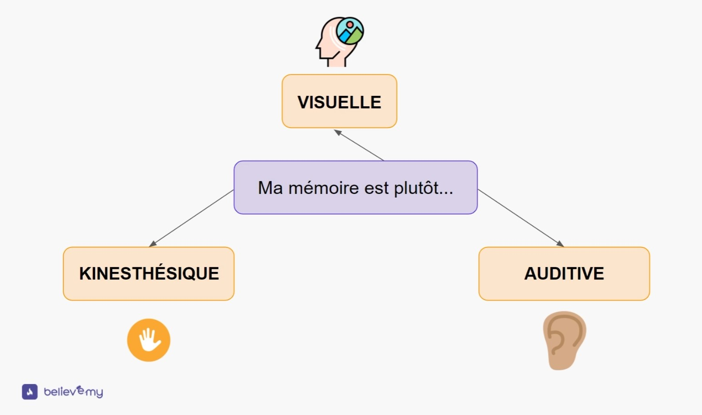
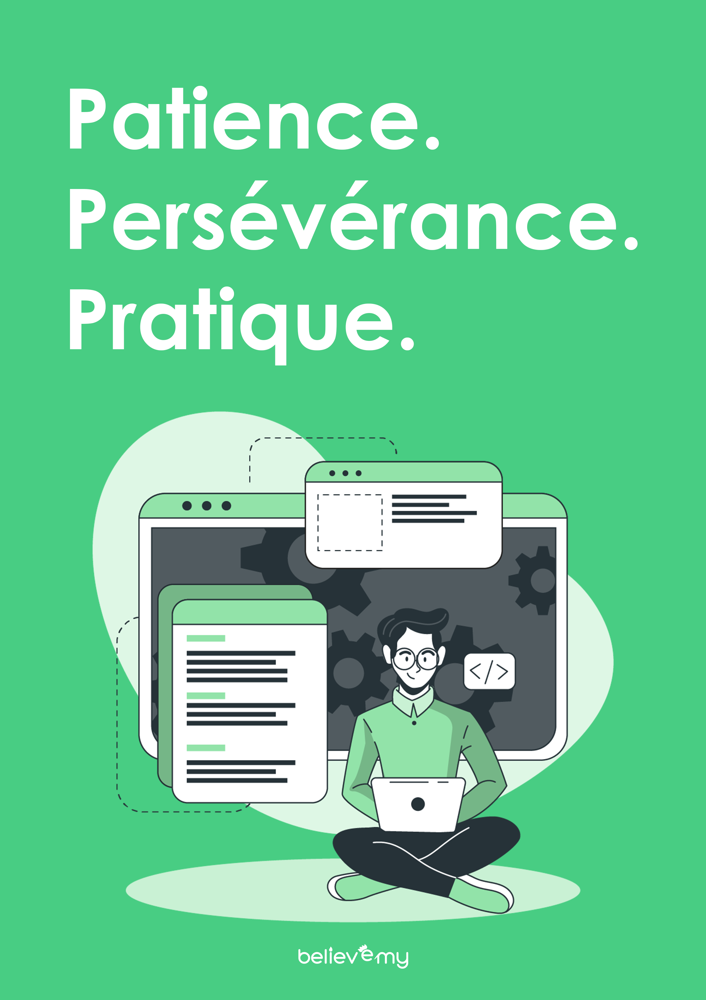

# Programme Rocket

Un petit résumé des différentes ressources présentent dans le programme rocket.

## Ressources

### 📚 Books

- [Pourquoi nous dormons](https://www.placedeslibraires.fr/livre/9782266287234-pourquoi-nous-dormons-matthew-walker/)
- [Avalez le crapaud !](https://www.placedeslibraires.fr/livre/9782924061688-avalez-le-crapaud-brian-tracy/)

### 📻 Sounds

- [Lofi Coders](https://open.spotify.com/playlist/0pGdGpMm84h2Jl6Q1KmTMn?si=r2PvhZU_R4aPW0O860rxZA)
- [Lofi Café](https://open.spotify.com/playlist/37i9dQZF1DX9RwfGbeGQwP?si=eCGIEc9eTmyOgoBgKjof1g)
- [Chillhop Radio](https://open.spotify.com/playlist/0CFuMybe6s77w6QQrJjW7d?si=nURelKdmQ2GHKAep2w5HrQ)

### 🧠 Apprendre à Apprendre

- [Test personnel pour comprendre votre type de mémoire](https://sherpas.com/blog/test-type-memoire-visuelle-auditive-kinesthesique)

**3 types** de mémoire:

- La mémoire [Visuelle](ressources/Visuelle.jpg) 👁
- La mémoire [Kinesthésique](ressources/Kinesthesique.jpg) 💁🏼‍♂️
- La mémoire [Auditive](ressources/Auditive.jpg) 👂🏻

### 📋 La règle des trois P

- Patience
- Persévérance
- Pratique

Ce qui compte, ce n'est pas la motivation mais la **discipline** & la **persévérance**

  

### 🧰 Conseils

- Ayez une bonne posture
- Faite le tri sur son bureau
- Ambiance sonore zen
- Hydratation
- Se lever et bouger toutes les deux heures pendant 5min (méthode Pomodoro)
- Avoir des séances fréquentes, courtes & actives (être participatif, prendre des notes, [pyramide de la rétention](ressources/Edgar_Dale.jpg))
- Mettre en silencieux son système d'exploitation (mode lune / silence)
- Vider ses onglets dans le navigateur
- En faire un petit peu tous les jours plutot qu'une fois par semaine
- Planifier ses [Coding Times](https://docs.google.com/spreadsheets/d/1IqmVb-J2a_sSNaYOwP2DiH56tJpQGTcZFPbBtKRC5fk/edit?usp=sharing) (5 sessions à prévoir à l'avance)
- Nombre de session terminée doit être égale nombre de session sortie à chaque fin de semaine (objectif chiffré)
- Un homme qui entreprend et qui passe à l'action, s'endord le soir rempli de doutes et se lève le matin avec une attitude de conquérant / rempli d'espoir
- Donner du bonheur aux autres, ça vous apporte du bonheur
- Coding (matin / fin aprés-midi / nuit) -> entre 12h & 15h, c'est la zone morte
- Commencer votre journée avec ce que vous aimez le moins
- Ce que vous ne planifiez pas, vous ne le ferez pas

### 🥦 Alimentation

- Pas de Fast Food
- Thé ou Café
- Eau Plate & Gazeuse
- Courgettes
- Amandes
- Riz Basmati
- Huile Olive

### 🪦 4 Principales Raisons de l'Abandon

- Procrastination (remettre les choses au lendemain)
- Manque de confiance
- Manque d'amusement
- Surenchère de travail

### 🧱 7 Principales Raisons de la Procrastination

- Privilégier le plaisir immédiat
- Etre un perfectionniste (la qualité, elle est relative)
- Etre découragé devant une tâche peu agréable
- Aimer le stress
- Les croyances limitantes
- Manque de motivation
- Les objectifs mal formulés

### 🎯 Objectifs SMART & SMARTER

- **S**pécifique
- **M**esurable
- **A**mbitieux
- **R**éaliste
- **T**emporel
- **E**xcitant
- **R**écompensé

